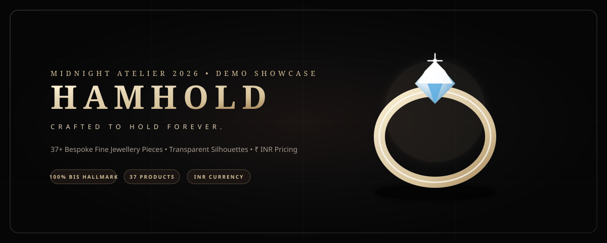

<div align="center">

# 💎 HAMHOLD

### CRAFTED TO HOLD FOREVER.

<p align="center">
  <em>A premium, responsive luxury jewellery e-commerce experience built around cinematic visuals, sophisticated product discovery, and contemporary editorial design.</em>
</p>

[](https://github.com/Martish-cloud/HAMHOLD-Jewellery)

<br />

[](https://github.com/Martish-cloud/HAMHOLD-Jewellery)
[](https://github.com/Martish-cloud/HAMHOLD-Jewellery)
[](https://github.com/Martish-cloud/HAMHOLD-Jewellery)
[](https://github.com/Martish-cloud/HAMHOLD-Jewellery)
[](https://github.com/Martish-cloud/HAMHOLD-Jewellery)

</div>

---

## 💎 About HAMHOLD

**HAMHOLD** is a fictional high-end luxury fine jewellery demonstration platform engineered for prospective client presentations. Built from the ground up to embody a completely independent, international luxury jewellery atelier, the website avoids generic white-and-gold e-commerce tropes in favor of the **Midnight Atelier** aesthetic — blending obsidian black, deep espresso, and restrained champagne accents with editorial typography and floating, transparent-background jewellery silhouettes.

Every touchpoint — from real-time Indian Rupee (₹) pricing and 6-digit PIN code delivery checks to interactive size selection and a sliding cart drawer — mirrors the standards of leading international fine jewellery houses.

---

## ✨ Highlights

* **37 Bespoke Products**: A complete, balanced catalogue spanning Women's and Men's fine jewellery.
* **Transparent Silhouettes**: Primary product catalogue cards feature isolated jewellery floating against obsidian pedestals with zero bounding boxes.
* **Indian Rupee (₹ INR) Pricing**: Realistic luxury tiers ranging from entry luxury (₹18,500) to gala statements (₹3,45,000+).
* **Midnight Atelier Design**: A cinematic palette (`#0B0B0C`, `#1A1412`, `#F4F0E8`, `#D6C29A`, `#A8875B`).
* **Desktop Custom Cursor**: Spring-interpolated cursor with dynamic `VIEW` and `EXPLORE` hover states (gracefully disabled on touch devices).
* **Interactive Shopping Cart & Wishlist**: Slide-out drawers with local storage persistence, quantity controls, promo code testing (`FOREVER10`), and a simulated checkout flow with celebratory confetti.
* **Interactive Gift Finder**: Multi-criteria selector (recipient, milestone, budget) that dynamically filters the actual catalogue in real time.
* **Instant Search & Filters**: Live searching across all 37 products, category chips, metal filters, and price tier sorting.
* **Strict Brand Isolation**: 100% pure HAMHOLD branding throughout.

---

## 🛍️ Product Experience

The catalogue spans eight distinct jewellery classifications:

1. **Rings** (Aurelia Solitaire, Elysian Emerald Solitaire, Seraphina Eternity Band, Lyra Halo, Vesper Sapphire, Solstice Fluted Band)
2. **Earrings** (Astra Celestial Drops, Celeste Pearl Drops, Lumina Studs, Zephyr Hoops, Bellatrix Chandeliers, Mirage Climbers)
3. **Necklaces** (Harmonia Tennis Necklace, Valentina Pearl Strand, Kismet Station Necklace, Solaria Herringbone Collar, Elysium Choker)
4. **Bracelets** (Nocturne Diamond Tennis Bracelet, Aureole Twisted Bangle, Serena Pearl Charm, Calypso Emerald Bracelet, Eclipse Noir)
5. **Pendants** (Velora Cushion Emerald, Orion Floating Solitaire, Selene Tahitian Black Pearl, Astraea Constellation Locket)
6. **Bangles & Kada** (Maharani Pavé Broad Bangle, Samara Ribbed Open Bangle, Nirvana Uncut Polki & Emerald Kada)
7. **Nose Rings & Pins** (Serein Diamond Floral Pin, Zara Crescent Diamond Wire Ring)
8. **For Him / Men's Atelier** (Monarch Imperial Gold & Diamond Kada, Élan Platinum Cuff, Sovereign Onyx Signet, Atlas Cuban Chain, Titan Platinum Band, Vulcan Compass Medallion)

---

## 📱 Responsive Design

The interface adapts seamlessly across all viewport widths without unintended horizontal scrolling:

* **Mobile (320px – 480px)**: Dedicated slide-out menu drawer, sticky bottom navigation bar (Home, Shop, Search, Wishlist, Bag), bottom-sheet filters, swipeable category carousels, and thumb-friendly touch targets.
* **Tablet (768px – 1024px)**: Fluid multi-column grids (2–3 columns), balanced editorial typography, and collapsible drawers.
* **Desktop (1280px – 2560px+)**: Mega dropdown menus, desktop-only custom cursor with text overlays, high-resolution modal zoom, and spacious 4-column product grids.

---

## 🎨 Design System

### Palette — Midnight Atelier
| Color Name | Hex Code | Purpose |
| :--- | :--- | :--- |
| **Obsidian Black** | `#0B0B0C` | Primary canvas & backdrop |
| **Deep Espresso** | `#1A1412` | Secondary atmospheric containers |
| **Warm Ivory** | `#F4F0E8` | High-contrast editorial typography |
| **Champagne** | `#D6C29A` | Signature accents, prices, & highlights |
| **Soft Bronze** | `#A8875B` | Structural borders & subtle warm tones |
| **Muted Taupe** | `#A59B8D` | Secondary descriptive copy |

### Typography
* **Editorial Headlines**: *Cormorant Garamond* & *Playfair Display*
* **Interface & Body**: *Plus Jakarta Sans* & *Inter*

---

## ⚡ Features

| Feature | Description | Status |
| :--- | :--- | :---: |
| **Responsive UI** | Fluid layouts optimized for mobile, tablet, and desktop | ✅ |
| **Product Catalogue** | 37 unique pieces with rich specifications | ✅ |
| **Transparent Images** | Vector isolated jewellery with zero background clashes | ✅ |
| **Product Filtering** | Multi-faceted filtering by Category, Gender, Collection, Metal, & Price | ✅ |
| **Instant Search** | Real-time query matching with suggested keyword chips | ✅ |
| **Interactive Cart** | Slide-out drawer, free shipping meter, and promo code support | ✅ |
| **Wishlist** | Local storage persistent wishlist with one-click "Move to Bag" | ✅ |
| **INR Currency** | Displayed across all customer-facing touchpoints (₹) | ✅ |
| **Gift Finder** | Dynamic multi-criteria selector that filters matching items | ✅ |
| **Mock Checkout** | Complete delivery address and simulated payment flow with confetti | ✅ |
| **Custom Cursor** | Spring-animated desktop cursor with `VIEW` and `EXPLORE` modes | ✅ |
| **HM Favicon** | Monogram HM only across all standard sizes | ✅ |

---

## 🧰 Tech Stack

* **Frontend Framework**: [React 19](https://react.dev/)
* **Build Tool**: [Vite 8](https://vitejs.dev/)
* **Styling**: [Tailwind CSS v3](https://tailwindcss.com/) & PostCSS
* **Icons**: [Lucide React](https://lucide.dev/)
* **Celebration Effects**: [Canvas Confetti](https://www.npmjs.com/package/canvas-confetti)
* **Fonts**: Google Fonts (*Cormorant Garamond*, *Playfair Display*, *Plus Jakarta Sans*)

---

## 🚀 Getting Started

### Prerequisites
* **Node.js** (v18.0.0 or higher)
* **npm** (v9.0.0 or higher)

### Installation
```bash
# Clone the repository
git clone https://github.com/Martish-cloud/HAMHOLD-Jewellery.git

# Navigate into project directory
cd HAMHOLD-Jewellery

# Install dependencies
npm install

# Start development server
npm run dev
```

Visit `http://localhost:5173` in your browser.

### Building for Production
```bash
npm run build
```

Preview production build:
```bash
npm run preview
```

---

## 📂 Project Structure

```text
HAMHOLD Jewellery/
├── public/
│   ├── images/
│   │   └── products/              # 37 isolated transparent SVG jewellery assets
│   ├── apple-touch-icon.png       # HM Monogram 180x180
│   ├── favicon-16x16.png          # HM Monogram 16x16
│   ├── favicon-32x32.png          # HM Monogram 32x32
│   ├── favicon-48x48.png          # HM Monogram 48x48
│   ├── icon-192.png               # HM Monogram 192x192
│   ├── icon-512.png               # HM Monogram 512x512
│   ├── favicon.svg                # HM Monogram vector favicon
│   ├── manifest.json              # Web App Manifest
│   └── preview-banner.svg         # Animated SVG showcase banner
├── scripts/
│   ├── generate-favicons.mjs      # Pure JS PNG favicon encoder
│   ├── generate-product-images.mjs # 37 Photorealistic transparent SVG generator
│   └── verify-brand.mjs          # Strict brand isolation auditor
├── src/
│   ├── components/
│   │   ├── AboutModal.jsx         # Atelier brand story modal
│   │   ├── Bestsellers.jsx        # Most Wanted products showcase
│   │   ├── BrandStory.jsx         # Why HAMHOLD? philosophy
│   │   ├── CartDrawer.jsx         # Slide-out cart & mock checkout
│   │   ├── CollectionsSection.jsx # 5 HAMHOLD collections showcase
│   │   ├── ContactModal.jsx       # Client Concierge inquiry modal
│   │   ├── Craftsmanship.jsx      # 5 Atelier craftsmanship steps
│   │   ├── CustomCursor.jsx       # Desktop spring-interpolated cursor
│   │   ├── EditorialCampaign.jsx  # The Art of Becoming banner
│   │   ├── Footer.jsx             # Luxury footer & newsletter
│   │   ├── ForHerSection.jsx      # Women's jewellery showcase
│   │   ├── ForHimSection.jsx      # Men's jewellery showcase
│   │   ├── GiftFinder.jsx         # Multi-criteria interactive finder
│   │   ├── Hero.jsx               # Cinematic hero section
│   │   ├── MobileNav.jsx          # Mobile drawer & sticky bottom bar
│   │   ├── Navbar.jsx             # Luxury navigation & mega dropdown
│   │   ├── NewArrivals.jsx        # Latest atelier additions
│   │   ├── ProductCard.jsx        # Floating transparent product card
│   │   ├── ProductDetailModal.jsx # Detail modal with zoom & pincode check
│   │   ├── ProductListingPage.jsx # Full catalogue with filters & sorting
│   │   ├── SearchModal.jsx        # Instant live search modal
│   │   ├── ShopByCategory.jsx     # Category grid & mobile carousel
│   │   ├── Toast.jsx              # Interactive notification toast
│   │   ├── TrustSection.jsx       # BIS Hallmark & insured shipping
│   │   └── WishlistDrawer.jsx     # Slide-out saved pieces drawer
│   ├── context/
│   │   └── ShopContext.jsx        # Global state (Cart, Wishlist, Modals)
│   ├── data/
│   │   └── products.js            # 37 products, collections, INR formatter
│   ├── App.jsx                    # Master application layout
│   ├── index.css                  # Tailwind styles, glassmorphism, & cursor
│   └── main.jsx                   # Application entrypoint
├── index.html                     # HTML5 template with HM favicon & Google Fonts
├── package.json                   # Dependencies and npm scripts
├── postcss.config.js              # PostCSS configuration
├── tailwind.config.js             # Midnight Atelier Tailwind theme
└── vite.config.js                 # Vite bundler configuration
```

---

## 🌐 Demo Preview

* **Brand Wordmark**: HAMHOLD
* **Brand Tagline**: *CRAFTED TO HOLD FOREVER.*
* **Favicon**: HM Monogram
* **Target Audience**: Client demonstration for prospective jewellery brand presentation

---

## 📄 License

This project is licensed under the MIT License — see the [LICENSE](LICENSE) file for details.
